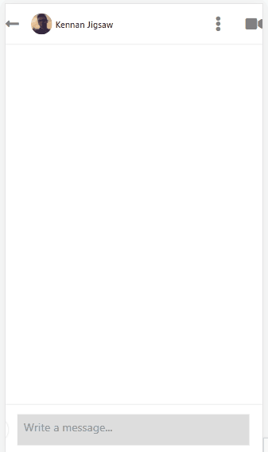

# How to Build a Chat App using ReactNative and Firebase (LinkedIn Clone)

Read the full tutorial here: [**>> How to Build a Chat App using ReactNative and Firebase (LinkedIn Clone)**](https://daltonic.github.io)

This example shows How to Build a Chat App using ReactNative and Firebase (LinkedIn Clone):



<center><figcaption>LinkedIn Clone Chat Interface</figcaption></center>


<center><figcaption>LinkedIn Clone Posts Interface</figcaption></center>

## Technology

This demo uses:

- React Native
- Firebase
- CometChat
- Formik
- Yup
- Expo

## Running the demo

To run the demo follow these steps:

1. Clone the github project on the terminal `git clone https://github.com/Daltonic/linkedin-clone`.
2. Open the project in VSCode and replace the firebase config object with yours from firebase.
   ```js
   const firebaseConfig = {
     apiKey: 'xxx-xxx-xxx-xxx-xxx-xxx-xxx-xxx',
     authDomain: 'xxx-xxx-xxx-xxx-xxx-xxx-xxx',
     databaseURL: 'xxx-xxx-xxx-xxx-xxx-xxx-xxx-xxx-xxx',
     projectId: 'xxx-xxx-xxx',
     storageBucket: 'xxx-xxx-xxx-xxx-xxx',
     messagingSenderId: 'xxx-xxx-xxx',
     appId: 'xxx-xxx-xxx-xxx-xxx-xxx-xxx-xxx',
     measurementId: 'xxx-xxx-xxx',
   }
   ```
3. Open new terminal and run the following commands.
   ```sh
   yarn install
   yarn start
   # The app will lunch on the browser
   ```
4. Open the browser and select the web interface option.

<br/>

Questions about running the demo? [Open an issue](https://github.com/Daltonic/linkedin-clone/issues). We're here to help ✌️

## Useful links

- 🏠 [Website](https://daltonic.github.io/)
- 🔥 [ReactNative](https://reactnative.dev/)
- 🚀 [Firebase](https://firebase.google.com/)
- 🎅 [CometChat](https://firebase.google.com/)
- 🏠 [Expo](https://expo.dev/)
- ✨ [Live Demo](https://rn-linkedin-clone-a1b25.firebaseapp.com/)
